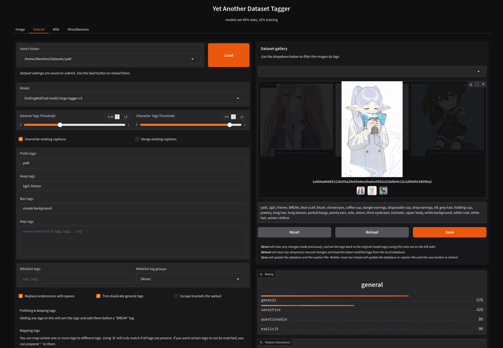

# yadt
Yet Another Dataset Tagger

### How to run
The recommended way of running the repo is using [uv](https://github.com/astral-sh/uv). 

#### Running with uv
Once `uv` is installed, you can run `uv sync` in order to grab the necessary Python dependencies.

Afterwards, simply run `uv run main.py` in order to start the UI.

#### Running with a venv
You can also use Python's built-in virtual environments to run the project. Run `python3 -m venv .venv` to create your environment, then activate it using `. .venv/bin/activate`. To install the dependencies, you need to run `pip install -r requirements-cpu.txt`.

Afterwards, run `python3 main.py` to start the UI.

## Preview

